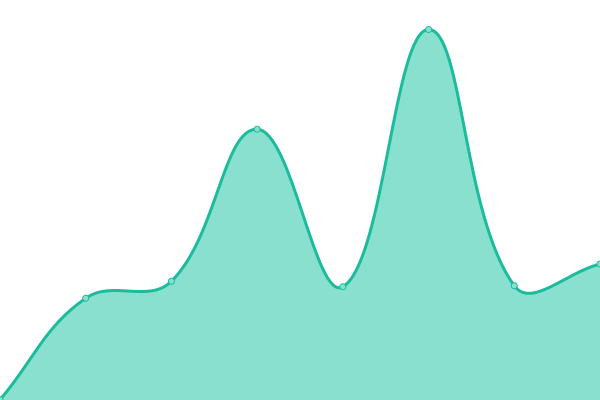

# [📈 Live Status](https://caro-health.github.io/upptime): <!--live status--> **🟩 All systems operational**

This repository contains the open-source uptime monitor and status page for [Caro Health](https://www.caro.health/), powered by [Upptime](https://github.com/upptime/upptime).

With [Upptime](https://upptime.js.org), you can get your own unlimited and free uptime monitor and status page, powered entirely by a GitHub repository. We use [Issues](https://github.com/caro-health/upptime/issues) as incident reports, [Actions](https://github.com/caro-health/upptime/actions) as uptime monitors, and [Pages](https://caro-health.github.io/upptime) for the status page.

<!--start: status pages-->
<!-- This summary is generated by Upptime (https://github.com/upptime/upptime) -->
<!-- Do not edit this manually, your changes will be overwritten -->
<!-- prettier-ignore -->
| URL | Status | History | Response Time | Uptime |
| --- | ------ | ------- | ------------- | ------ |
|  [Caro Company Site](https://caro.health) | 🟩 Up | [caro-company-site.yml](https://github.com/caro-health/upptime/commits/HEAD/history/caro-company-site.yml) | 

 970ms
     
 | 

<a href="https://caro-health.github.io/upptime/history/caro-company-site">100.00%</a>
    

|  [Caro Blog](https://www.caro.health/blog) | 🟩 Up | [caro-blog.yml](https://github.com/caro-health/upptime/commits/HEAD/history/caro-blog.yml) | 

 187ms
     
 | 

<a href="https://caro-health.github.io/upptime/history/caro-blog">100.00%</a>
    

|  [Caro Portal](https://caroclinic.caro.health) | 🟩 Up | [caro-portal.yml](https://github.com/caro-health/upptime/commits/HEAD/history/caro-portal.yml) | 

 709ms
     
 | 

<a href="https://caro-health.github.io/upptime/history/caro-portal">100.00%</a>
    

|  [Caro API](https://vjtbsbd4htmgs3z6qtxpmy72z40ddkae.lambda-url.eu-west-1.on.aws/api/status) | 🟩 Up | [caro-api.yml](https://github.com/caro-health/upptime/commits/HEAD/history/caro-api.yml) | 

 582ms
     
 | 

<a href="https://caro-health.github.io/upptime/history/caro-api">100.00%</a>
    

<!--end: status pages-->

[**Visit our status website →**](https://caro-health.github.io/upptime)

## 📄 License

- Powered by: [Upptime](https://github.com/upptime/upptime)
- Code: [MIT](./LICENSE) © [Anand Chowdhary](https://anandchowdhary.com), supported by [Pabio](https://pabio.com)
- Data in the `./history` directory: [Open Database License](https://opendatacommons.org/licenses/odbl/1-0/)
